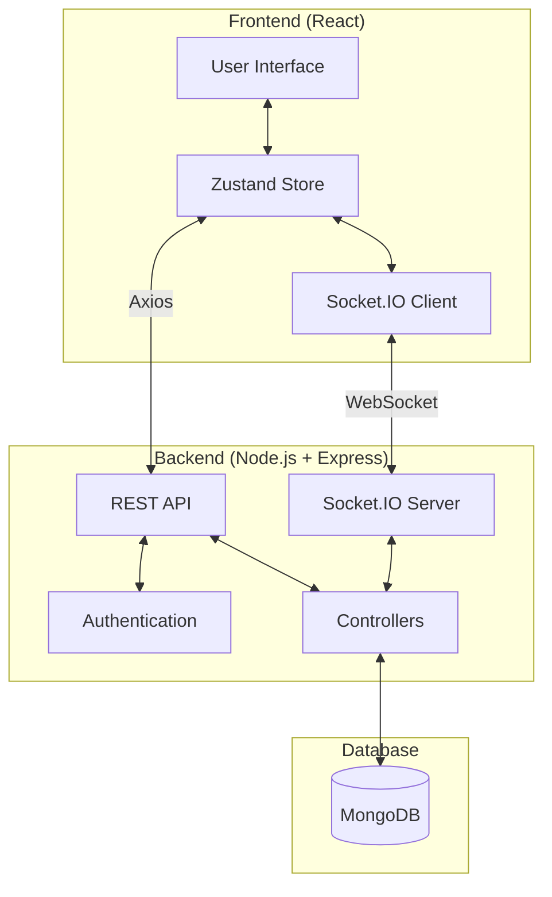
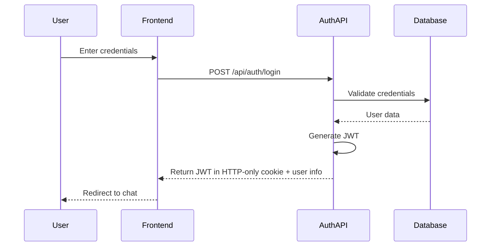
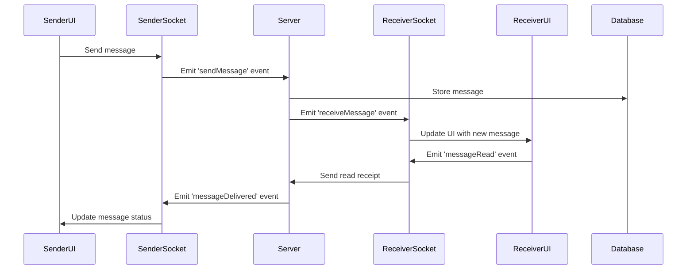
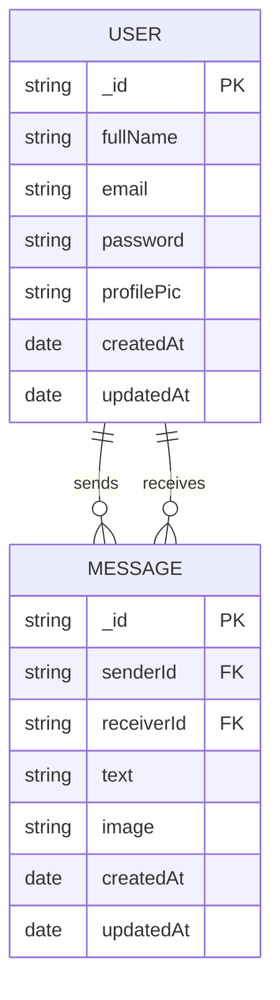
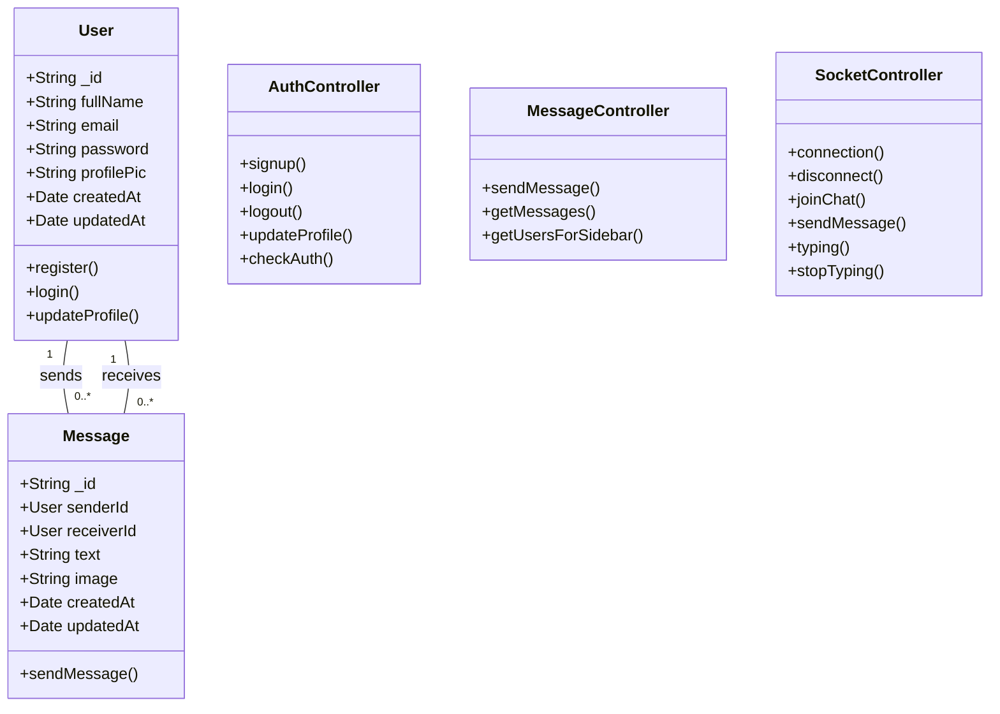

# Converge

A real-time chat web application enabling secure one-on-one conversations with dynamic UI themes.

## Overview

Converge is a full-stack real-time chat application that enables users to have secure one-on-one conversations. It features a modern UI with dynamic theming options, JWT-based authentication, and end [...]

## Features

- **User Authentication**
  - Secure registration and login with JWT
  - Password encryption using bcrypt
  - Session management
  
- **Real-time Messaging**
  - Instant message delivery using Socket.IO
  - Read receipts
  - Typing indicators
  - Message history persistence
  
- **User Experience**
  - Dynamic UI theming
  - Responsive design for all devices
  - Contact list with online status indicators
  - Message search functionality
  
- **Security**
  - JWT token-based authentication with HTTP-only cookies
  - Password hashing
  - Protected routes
  - Input validation

## Tech Stack

### Frontend
- **React.js** - UI library
- **Zustand** - State management
- **Axios** - HTTP client for API requests
- **Socket.IO Client** - Real-time communication
- **Tailwind CSS** - Utility-first CSS framework
- **DaisyUI** - Component library for Tailwind

### Backend
- **Node.js** - JavaScript runtime
- **Express.js** - Web framework
- **MongoDB** - NoSQL database
- **Mongoose** - MongoDB ODM
- **Socket.IO** - Real-time bidirectional communication
- **JWT** - Authentication
- **Bcrypt** - Password hashing

## Architecture

Converge follows a modern client-server architecture with real-time capabilities:



## Application Workflow

### Authentication Flow



### Messaging Flow



## Data Models

### Entity Relationship Diagram



### Class Diagram



## API Documentation

### Authentication Endpoints

| Method | Endpoint           | Description                  | Request Body                      | Response                          |
|--------|-------------------|------------------------------|----------------------------------|-----------------------------------|
| POST   | /api/auth/signup   | Register a new user          | { fullName, email, password }        | { _id, fullName, email } + JWT cookie |
| POST   | /api/auth/login    | Login an existing user       | { email, password }              | { _id, fullName, email } + JWT cookie |
| POST   | /api/auth/logout   | Logout user                  | -                                | Success message                   |
| PUT    | /api/auth/update-profile | Update user profile    | { fullName, email, profilePic }      | { _id, fullName, email, profilePic }  |
| GET    | /api/auth/check    | Verify authentication        | -                                | { _id, fullName, email }              |

### Message Endpoints

| Method | Endpoint                | Description                  | Request Body                      | Response                          |
|--------|------------------------|------------------------------|----------------------------------|-----------------------------------|
| GET    | /api/messages/users    | Get users for sidebar        | -                                | [User objects]                    |
| GET    | /api/messages/:id      | Get messages for a chat      | -                                | [Message objects]                 |
| POST   | /api/messages/send/:id | Send a message               | { text, image }                  | Message object                    |

## Installation and Setup

### Prerequisites
- Node.js (v14 or higher)
- MongoDB
- npm or yarn

### Backend Setup
```bash
# Clone the repository
git clone https://github.com/MayankB1708/Converge.git
cd Converge/backend

# Install dependencies
npm install

# Set up environment variables
cp .env.example .env
# Edit .env with your configuration

# Start the server
npm run dev
```

### Frontend Setup
```bash
# Navigate to frontend directory
cd ../frontend

# Install dependencies
npm install

# Start the development server
npm start
```

## Usage Guide

1. **Registration and Login**
   - Create a new account with your name, email, and password
   - Login with your credentials

2. **Finding Contacts**
   - Use the search functionality to find other users
   - Click on a user to start a conversation

3. **Messaging**
   - Type your message in the input field and press Enter or click Send
   - View real-time typing indicators when the other user is typing
   - See read receipts when your messages have been read

4. **UI Customization**
   - Access the settings menu to change UI theme
   - Choose from various color schemes and dark/light modes

## Future Improvements

- Group chat functionality
- File and media sharing
- Message encryption
- Voice and video calls
- Message reactions and threads
- Mobile applications (React Native)

## Detailed Feature Implementation

### Authentication System Implementation

The authentication system is built with security and user experience in mind:

1. **User Registration**:
   - The frontend collects user information through a form (fullName, email, password).
   - Passwords are validated for strength on the client-side using regex patterns (minimum 6 characters).
   - The data is sent to the backend via a POST request to `/api/auth/signup`.
   - On the server, the password is hashed using bcrypt with a salt factor of 10.
   - The backend checks if the email is already registered before creating a new user.
   - A JWT token is generated using the user's ID and a secret key stored in environment variables.
   - The token is set as an HTTP-only cookie and returned to the client along with user data (excluding password).

2. **User Login**:
   - The login form accepts email and password.
   - Credentials are sent to `/api/auth/login` endpoint.
   - The backend retrieves the user record by email.
   - The stored hashed password is compared with the provided password using bcrypt's compare function.
   - If authentication succeeds, a JWT token is generated and set as an HTTP-only cookie.
   - User data (excluding password) is returned to the client.

3. **Authentication Middleware**:
   - Every protected route uses a middleware function that validates the JWT token.
   - The token is extracted from the HTTP-only cookie.
   - If the token is valid, the user ID is attached to the request object for use in route handlers.
   - Invalid or expired tokens result in 401 Unauthorized responses.

### Real-time Communication Implementation

Real-time features are implemented using Socket.IO with a carefully designed event system:

1. **Socket Connection Management**:
   - When a user logs in, the frontend establishes a Socket.IO connection.
   - The JWT token from the cookie is used for socket authentication.
   - On the server, a socket middleware validates the token before allowing connection.
   - Connected users are tracked in an in-memory map with their socket IDs and user IDs.
   - When users disconnect, they're removed from this tracking system.

2. **Chat Initialization**:
   - When a user opens a chat, the frontend emits a `joinChat` event with the user ID.
   - The server adds the user's socket to a room to enable direct messaging.
   - This room-based system ensures messages are only sent to relevant participants.

3. **Messaging System**:
   - When a user sends a message, the client emits a `sendMessage` event with message text and/or image, and recipient ID.
   - The server:
     - Saves the message to MongoDB with senderId, receiverId, text, and image.
     - Emits a `receiveMessage` event to the receiver.
   - Recipients' clients listen for `receiveMessage` and update their UI accordingly.

4. **Typing Indicators**:
   - When a user starts typing, the client emits a `typing` event with the recipient ID.
   - The server broadcasts this to the recipient.
   - When typing stops (detected by debounced input), a `stopTyping` event is emitted.
   - Recipients show and hide the "user is typing" indicator based on these events.

### Database Integration

The MongoDB integration is structured for efficient real-time operations:

1. **Schema Design**:
   - User and Message models are designed with references for optimal data organization.
   - Indexes are created on frequently queried fields to improve performance.

2. **Query Optimization**:
   - Message retrieval is optimized to efficiently load conversations between users.
   - User searches use efficient queries to populate the sidebar.

3. **Data Consistency**:
   - When a message is sent, the Message collection is updated atomically.
   - User data is protected with proper validation and access controls.

### User Interface Implementation

The UI is built with React and enhanced with Tailwind CSS and DaisyUI:

1. **Component Architecture**:
   - The application follows a component-based architecture with reusable elements.
   - Main components include: ChatList, ChatBox, MessageInput, UserProfile, and LoginForm.
   - Each component has its own CSS module or Tailwind classes for styling.

2. **State Management**:
   - Zustand is used for application state management:
     - authStore: Manages user authentication state
     - chatStore: Handles active chats and messages
     - socketStore: Provides socket connection throughout the app
   - These stores are easily accessible throughout the application with minimal boilerplate code.
   - Local component state is used for UI-specific states like input values and modal visibility.

3. **Theme System**:
   - The theme system leverages DaisyUI's theme attributes.
   - Users can select from predefined themes or customize color schemes.
   - Theme preferences are stored in localStorage and applied on application load.
   - A theme store in Zustand provides theme toggling functionality throughout the app.

4. **Responsive Design**:
   - The layout uses Tailwind's responsive classes for different screen sizes.
   - On mobile, the interface switches between the chat list and active chat with smooth transitions.
   - Flexbox and CSS Grid are used for complex layouts like the message bubble arrangement.

5. **Performance Optimization**:
   - React.memo is used to prevent unnecessary re-renders.
   - Large lists (like messages and chats) use virtualization to render only visible items.
   - Images are lazy-loaded and optimized.
   - Debouncing is applied to search inputs and typing indicators to reduce network traffic.

### Security Implementation

Multiple security layers protect user data and communications:

1. **Password Security**:
   - Passwords are never stored in plain text, only bcrypt hashes.
   - Password reset flows use time-limited tokens sent to verified email addresses.
   - Password strength requirements enforce a minimum length of 6 characters.

2. **Input Validation**:
   - All user inputs are validated using a combination of frontend and backend validation.
   - Express-validator middleware validates request parameters.
   - MongoDB queries use parameterized operations to prevent injection attacks.

3. **Rate Limiting**:
   - API endpoints are rate-limited to prevent brute force attacks.
   - Socket events are also rate-limited to prevent spam.

4. **Token Management**:
   - JWTs are stored in HTTP-only cookies to prevent access by client-side JavaScript.
   - Cookies have an expiration time (24 hours by default) and secure flags in production.
   - Sensitive operations require token re-validation.
   - Token refresh mechanisms allow for extended sessions without compromising security.

5. **Environmental Security**:
   - All sensitive configuration (database URLs, JWT secrets) is stored in environment variables.
   - Production deployments use HTTPS with proper certificate management.
   - CSRF protection is implemented for cookie-based authentication.
