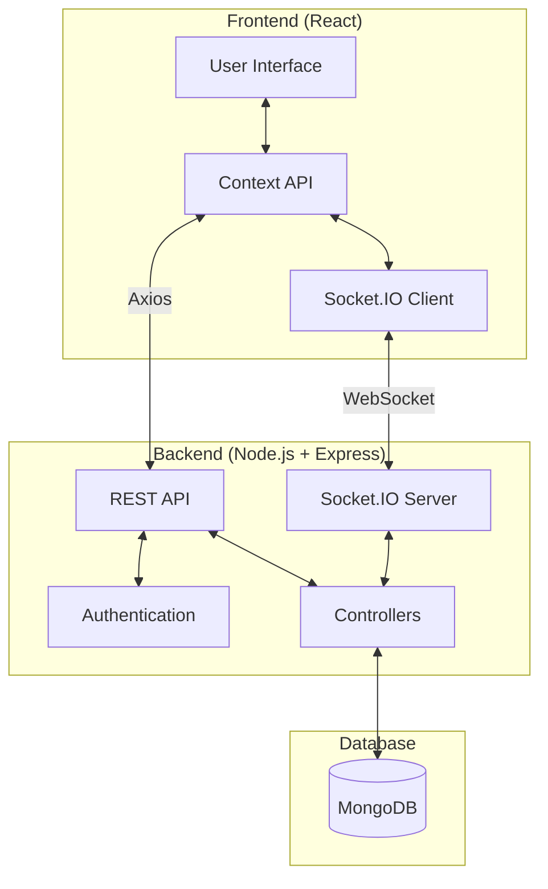
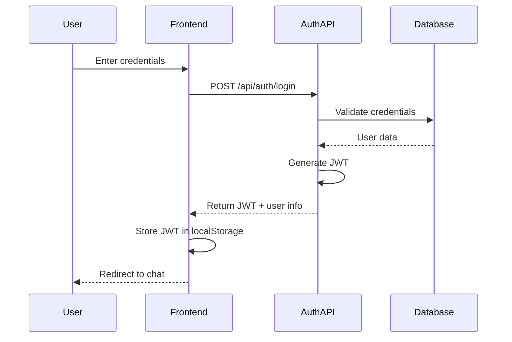
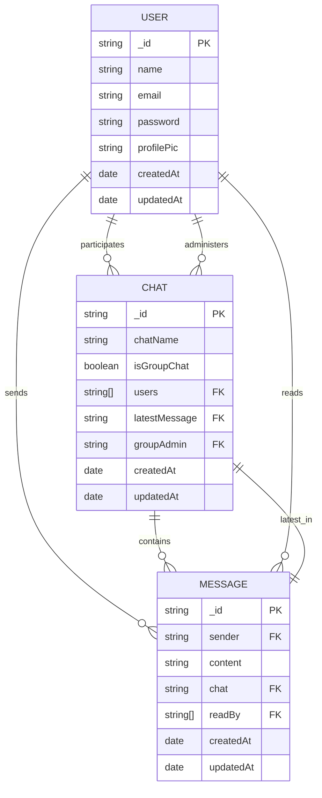
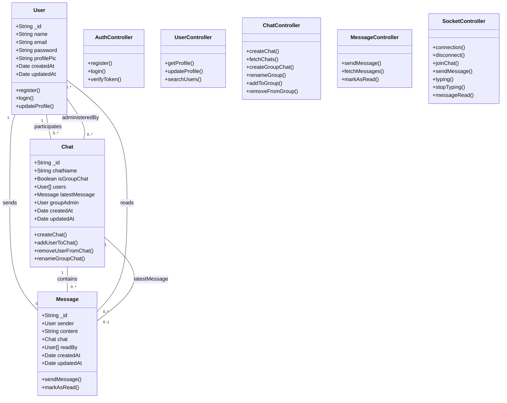

# Converge

A real-time chat web application enabling secure one-on-one conversations with dynamic UI themes.

## Overview

Converge is a full-stack real-time chat application that enables users to have secure one-on-one conversations. It features a modern UI with dynamic theming options, JWT-based authentication, and end-to-end message delivery via Socket.IO.

## Features

- **User Authentication**
  - Secure registration and login with JWT
  - Password encryption using bcrypt
  - Session management
  
- **Real-time Messaging**
  - Instant message delivery using Socket.IO
  - Read receipts
  - Typing indicators
  - Message history persistence
  
- **User Experience**
  - Dynamic UI theming
  - Responsive design for all devices
  - Contact list with online status indicators
  - Message search functionality
  
- **Security**
  - JWT token-based authentication
  - Password hashing
  - Protected routes
  - Input validation

## Tech Stack

### Frontend
- **React.js** - UI library
- **Context API** - State management
- **Axios** - HTTP client for API requests
- **Socket.IO Client** - Real-time communication
- **Tailwind CSS** - Utility-first CSS framework
- **DaisyUI** - Component library for Tailwind

### Backend
- **Node.js** - JavaScript runtime
- **Express.js** - Web framework
- **MongoDB** - NoSQL database
- **Mongoose** - MongoDB ODM
- **Socket.IO** - Real-time bidirectional communication
- **JWT** - Authentication
- **Bcrypt** - Password hashing

## Architecture

Converge follows a modern client-server architecture with real-time capabilities:



## Application Workflow

### Authentication Flow



### Messaging Flow


## Data Models

### Entity Relationship Diagram



### Class Diagram



## API Documentation

### Authentication Endpoints

| Method | Endpoint           | Description                  | Request Body                      | Response                          |
|--------|-------------------|------------------------------|----------------------------------|-----------------------------------|
| POST   | /api/auth/register | Register a new user          | { name, email, password }        | { _id, name, email, token }       |
| POST   | /api/auth/login    | Login an existing user       | { email, password }              | { _id, name, email, token }       |

### User Endpoints

| Method | Endpoint           | Description                  | Request Body                      | Response                          |
|--------|-------------------|------------------------------|----------------------------------|-----------------------------------|
| GET    | /api/users        | Search for users             | Query params: search             | [{ _id, name, email, pic }]       |
| GET    | /api/users/:id    | Get a specific user          | -                                | { _id, name, email, pic }         |
| PUT    | /api/users/profile| Update user profile          | { name, email, pic }             | { _id, name, email, pic }         |

### Chat Endpoints

| Method | Endpoint                | Description                  | Request Body                      | Response                          |
|--------|------------------------|------------------------------|----------------------------------|-----------------------------------|
| POST   | /api/chats             | Create/access a chat         | { userId }                       | Chat object                       |
| GET    | /api/chats             | Get all user chats           | -                                | [Chat objects]                    |
| POST   | /api/chats/group       | Create a group chat          | { name, users }                  | Group Chat object                 |
| PUT    | /api/chats/rename      | Rename a group               | { chatId, chatName }             | Group Chat object                 |
| PUT    | /api/chats/groupadd    | Add user to group            | { chatId, userId }               | Group Chat object                 |
| PUT    | /api/chats/groupremove | Remove user from group       | { chatId, userId }               | Group Chat object                 |

### Message Endpoints

| Method | Endpoint                | Description                  | Request Body                      | Response                          |
|--------|------------------------|------------------------------|----------------------------------|-----------------------------------|
| POST   | /api/messages          | Send a message               | { content, chatId }              | Message object                    |
| GET    | /api/messages/:chatId  | Get all chat messages        | -                                | [Message objects]                 |

## Installation and Setup

### Prerequisites
- Node.js (v14 or higher)
- MongoDB
- npm or yarn

### Backend Setup
```bash
# Clone the repository
git clone https://github.com/MayankB1708/Converge.git
cd Converge/backend

# Install dependencies
npm install

# Set up environment variables
cp .env.example .env
# Edit .env with your configuration

# Start the server
npm run dev
```

### Frontend Setup
```bash
# Navigate to frontend directory
cd ../frontend

# Install dependencies
npm install

# Start the development server
npm start
```

## Usage Guide

1. **Registration and Login**
   - Create a new account with your name, email, and password
   - Login with your credentials

2. **Finding Contacts**
   - Use the search functionality to find other users
   - Click on a user to start a conversation

3. **Messaging**
   - Type your message in the input field and press Enter or click Send
   - View real-time typing indicators when the other user is typing
   - See read receipts when your messages have been read

4. **UI Customization**
   - Access the settings menu to change UI theme
   - Choose from various color schemes and dark/light modes

## Future Improvements

- Group chat functionality
- File and media sharing
- Message encryption
- Voice and video calls
- Message reactions and threads
- Mobile applications (React Native)

## Detailed Feature Implementation

### Authentication System Implementation

The authentication system is built with security and user experience in mind:

1. **User Registration**:
   - The frontend collects user information through a form (name, email, password).
   - Passwords are validated for strength on the client-side using regex patterns.
   - The data is sent to the backend via a POST request to `/api/auth/register`.
   - On the server, the password is hashed using bcrypt with a salt factor of 10.
   - The backend checks if the email is already registered before creating a new user.
   - A JWT token is generated using the user's ID and a secret key stored in environment variables.
   - The token is returned to the client along with user data (excluding password).

2. **User Login**:
   - The login form accepts email and password.
   - Credentials are sent to `/api/auth/login` endpoint.
   - The backend retrieves the user record by email.
   - The stored hashed password is compared with the provided password using bcrypt's compare function.
   - If authentication succeeds, a JWT token is generated and returned to the client.
   - The frontend stores this token in localStorage and includes it in the Authorization header for subsequent requests.

3. **Authentication Middleware**:
   - Every protected route uses a middleware function that validates the JWT token.
   - The token is extracted from the Authorization header.
   - If the token is valid, the user ID is attached to the request object for use in route handlers.
   - Invalid or expired tokens result in 401 Unauthorized responses.

### Real-time Communication Implementation

Real-time features are implemented using Socket.IO with a carefully designed event system:

1. **Socket Connection Management**:
   - When a user logs in, the frontend establishes a Socket.IO connection.
   - The JWT token is sent with the connection request for authentication.
   - On the server, a socket middleware validates the token before allowing connection.
   - Connected users are tracked in an in-memory map with their socket IDs and user IDs.
   - When users disconnect, they're removed from this tracking system.

2. **Chat Initialization**:
   - When a user opens a chat, the frontend emits a `joinChat` event with the chat ID.
   - The server adds the user's socket to a room named after the chat ID.
   - This room-based system ensures messages are only sent to relevant participants.

3. **Messaging System**:
   - When a user sends a message, the client emits a `sendMessage` event with message content and chat ID.
   - The server:
     - Saves the message to MongoDB with sender, content, chat reference, and timestamp.
     - Updates the corresponding chat document with the latest message reference.
     - Emits a `receiveMessage` event to all users in the chat room.
   - Recipients' clients listen for `receiveMessage` and update their UI accordingly.
   - Messages are stored with a `readBy` array to track which users have seen them.

4. **Typing Indicators**:
   - When a user starts typing, the client emits a `typing` event with the chat ID.
   - The server broadcasts this to other users in the chat room.
   - When typing stops (detected by debounced input), a `stopTyping` event is emitted.
   - Recipients show and hide the "user is typing" indicator based on these events.

5. **Read Receipts**:
   - When a message appears in a user's viewport, the frontend emits a `messageRead` event.
   - The server updates the message document by adding the user to the `readBy` array.
   - The server then emits a `messageStatusUpdate` event to the sender.
   - The sender's UI updates to show read status (e.g., changing the checkmark color).

### Database Integration

The MongoDB integration is structured for efficient real-time operations:

1. **Schema Design**:
   - The three main models (User, Chat, Message) are designed with references to optimize querying.
   - The Chat model includes a reference to the latest message, enabling efficient chat list sorting.
   - Indexes are created on frequently queried fields to improve performance.

2. **Query Optimization**:
   - Chat list queries use MongoDB aggregation pipeline to populate user details and latest message in a single query.
   - Message retrieval is paginated, loading only 50 messages at a time with infinite scrolling.
   - Population depth is controlled to prevent excessive database lookups.

3. **Data Consistency**:
   - When a message is sent, both the Message collection and the Chat's latestMessage field are updated in a transaction.
   - User searches use text indexes for efficient partial matching.
   - Read statuses are updated using MongoDB's `$addToSet` operator to prevent duplicates.

### User Interface Implementation

The UI is built with React and enhanced with Tailwind CSS and DaisyUI:

1. **Component Architecture**:
   - The application follows a component-based architecture with reusable elements.
   - Main components include: ChatList, ChatBox, MessageInput, UserProfile, and LoginForm.
   - Each component has its own CSS module or Tailwind classes for styling.

2. **State Management**:
   - The Context API creates several contexts:
     - AuthContext: Manages user authentication state
     - ChatContext: Handles active chats and messages
     - SocketContext: Provides socket connection throughout the app
   - These contexts are provided at the app root level and consumed by relevant components.
   - Local component state is used for UI-specific states like input values and modal visibility.

3. **Theme System**:
   - The theme system leverages DaisyUI's theme attributes.
   - Users can select from predefined themes or customize color schemes.
   - Theme preferences are stored in localStorage and applied on application load.
   - A ThemeContext provides theme toggling functionality throughout the app.

4. **Responsive Design**:
   - The layout uses Tailwind's responsive classes for different screen sizes.
   - On mobile, the interface switches between the chat list and active chat with smooth transitions.
   - Flexbox and CSS Grid are used for complex layouts like the message bubble arrangement.

5. **Performance Optimization**:
   - React.memo is used to prevent unnecessary re-renders.
   - Large lists (like messages and chats) use virtualization to render only visible items.
   - Images are lazy-loaded and optimized.
   - Debouncing is applied to search inputs and typing indicators to reduce network traffic.

### Security Implementation

Multiple security layers protect user data and communications:

1. **Password Security**:
   - Passwords are never stored in plain text, only bcrypt hashes.
   - Password reset flows use time-limited tokens sent to verified email addresses.
   - Password strength requirements are enforced on both client and server.

2. **Input Validation**:
   - All user inputs are validated using a combination of frontend and backend validation.
   - Express-validator middleware validates request parameters.
   - MongoDB queries use parameterized operations to prevent injection attacks.

3. **Rate Limiting**:
   - API endpoints are rate-limited to prevent brute force attacks.
   - Socket events are also rate-limited to prevent spam.

4. **Token Management**:
   - JWTs have an expiration time (24 hours by default).
   - Sensitive operations require token re-validation.
   - Token refresh mechanisms allow for extended sessions without compromising security.

5. **Environmental Security**:
   - All sensitive configuration (database URLs, JWT secrets) is stored in environment variables.
   - Production deployments use HTTPS with proper certificate management.
   - HTTP-only cookies provide an additional layer of security for token storage in production.
